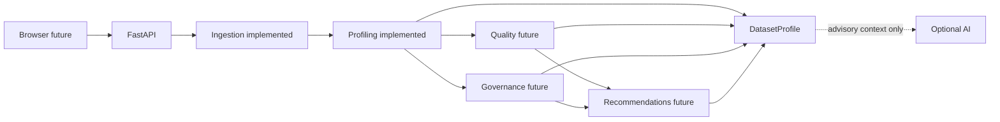

# Arquitectura

## Forma del sistema y estado actual

Monolito modular y stateless. Phase 2 implementa Ingestion y Profiling; Next.js y la API de análisis siguen siendo futuros. FastAPI expone únicamente `GET /health`. No hay DB, persistencia ni microservicios.

## Módulos y boundaries

- **Ingestion** valida bytes CSV/XLSX y produce `IngestedDataset`; no crea findings semánticos.
- **Profiling** recibe `IngestedDataset`, no reparsea ni muta el DataFrame, y crea métricas/Finding/Evidence estructurales `DETECTED`.
- **Quality** aplicará `QUALITY_MODEL.md`; no existe score en Phase 2.
- **Governance** creará classifications canónicas solo con señales deterministas; no existe en Phase 2.
- **Recommendations** producirá `SUGGESTED` vinculadas a findings existentes.
- **Presentation/API** serializa contratos sin recalcular resultados.

El lifecycle es `bytes no confiables → validación/límites → IngestedDataset → DatasetProfile → futura respuesta → cleanup`. Todo procesamiento actual es en memoria y sin persistencia.

## Frontera IA

**LLM output is advisory only.** Puede proponer significado, descripción, explicación y wording como `SUGGESTED`; no crea/muta Evidence canónica, findings `DETECTED`, metrics, scores ni governance classifications canónicas. No contribuye a confidence canónica ni hay aceptación humana en V0.1.

## Seguridad y dependencias

Polars realiza agregaciones y representación tabular; FastAPI/Pydantic delimitan la futura API; openpyxl lee XLSX. Los contenidos permanecen como datos no confiables: no logging de celdas, HTML crudo, paths ni instrucciones. Ver [ingestión](INGESTION.md), [profiling](PROFILING.md) y [privacidad](PRIVACY.md).
