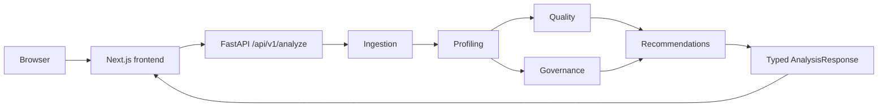

# Arquitectura

## Forma del sistema y estado actual

Monolito modular y stateless con frontend Next.js y backend FastAPI. Phase 8 implementa la experiencia web sobre la API determinista existente. FastAPI expone `GET /health` y `POST /api/v1/analyze`. No hay proxy API en Next.js, DB, persistencia, autenticación, microservicios ni implementación de IA.



El navegador se comunica directamente con FastAPI. Next.js no contiene route handlers, middleware de proxy ni una segunda capa de reglas.

## Módulos y boundaries

- **Ingestion** valida bytes CSV/XLSX y produce `IngestedDataset`; no crea findings semánticos.
- **Profiling** recibe `IngestedDataset`, no reparsea ni muta el DataFrame. Recoge métricas estructurales y soporte efímero de posiciones/signals deterministas, sin valores de celdas ni scores.
- **Quality** recibe solo `DatasetProfile`, no modifica el perfil ni reejecuta parsing/profiling. Posee applicability, fórmulas, penalties, scores y findings de parser conforme a `QUALITY_MODEL.md`.
- **Governance** recibe `DatasetProfile` y crea classifications canónicas solo con señales deterministas.
- **Recommendations** consume `QualityScore` y `GovernanceAssessment` y produce un `RecommendationSet` determinista de propuestas `SUGGESTED` vinculadas a findings existentes.
- **Analysis API** orquesta los motores y serializa el envelope tipado sin recalcular resultados ni incluir DataFrame, bytes o valores de celdas.
- **Frontend** valida únicamente archivo/extensión/tamaño como preflight, envía el archivo a FastAPI y presenta la respuesta sin duplicar reglas del backend.

### Integración Governance Engine

`DatasetProfile → Governance Engine → GovernanceAssessment`.

El Governance Engine consume `DatasetProfile`, no reabre archivos fuente, no accede a valores de celdas y no muta el perfil. Es determinista, separado del Quality Engine y no usa IA; no produce recomendaciones ni conclusiones de compliance o legales.

El lifecycle es `bytes no confiables → validación/límites → IngestedDataset → DatasetProfile → QualityScore/GovernanceAssessment → RecommendationSet → AnalysisResponse → estado efímero del navegador → cleanup`. Todo procesamiento V0.1 es stateless, en memoria y sin persistencia.

## Frontera IA

**LLM output is advisory only.** Una fase futura podría proponer significado, descripción, explicación y wording como `SUGGESTED`; no crearía ni mutaría Evidence canónica, findings `DETECTED`, metrics, scores ni governance classifications canónicas. Phase 8 no incluye proveedor LLM, chat ni código de IA.

## Frontend

La experiencia web implementada se documenta en [FRONTEND.md](FRONTEND.md):

```text
Browser → Next.js frontend → FastAPI → Analysis service → deterministic engines
```

El frontend consume `POST /api/v1/analyze` mediante `NEXT_PUBLIC_API_BASE_URL`; no accede directamente a motores ni duplica reglas. El backend y sus contratos siguen siendo la fuente de verdad. Phase 9 conserva el polish visual, la experiencia de demo y otras mejoras explícitamente diferidas.

## Seguridad y dependencias

Polars realiza agregaciones y representación tabular; FastAPI/Pydantic delimitan la API; openpyxl lee XLSX. Next.js presenta datos escapados y no incorpora renderizado HTML arbitrario. Los contenidos permanecen como datos no confiables: no logging de celdas, HTML crudo, paths ni instrucciones. Ver [ingestión](INGESTION.md), [profiling](PROFILING.md), [API](API.md) y [privacidad](PRIVACY.md).
