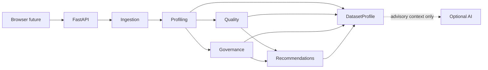

# Arquitectura

## Forma del sistema y estado actual

Monolito modular y stateless. Phase 1.1 implementa ingestión segura; Next.js, profiling y análisis siguen siendo futuros. FastAPI expone únicamente `GET /health`. No hay endpoint de análisis, DB, persistencia ni microservicios.

## Módulos y boundaries

- **Ingestion** valida bytes CSV/XLSX y produce `IngestedDataset`; no infiere significado ni crea findings.
- **Profiling** será la única fuente de counts, métricas y Evidence canónica.
- **Quality** aplicará `QUALITY_MODEL.md` sobre perfiles deterministas.
- **Governance** creará classifications canónicas solo con señales deterministas.
- **Recommendations** producirá `SUGGESTED` vinculadas a findings existentes.
- **Presentation/API** serializa contratos sin recalcular resultados.

El lifecycle es `bytes no confiables → validación/límites → IngestedDataset → futuro DatasetProfile → respuesta → cleanup`. La implementación Phase 1 procesa en memoria y no crea temporales; una futura ruta temporal deberá limpiarse ante éxito, fallo, cancelación o expiración.

## Ingestion implementada

`ingestion.service` enruta por extensión sin crear paths. CSV se lee UTF-8 con delimitadores permitidos y límites durante parsing. XLSX se trata como ZIP no confiable, se abre `read_only=True`, `data_only=False`, `keep_links=False`, no ejecuta fórmulas/macros y no usa valores calculados de fórmulas. Límites centralizados cubren bytes, filas, columnas, sheets, celdas, entradas ZIP y tamaño descomprimido.

## Frontera IA

**LLM output is advisory only.** Puede proponer significado semántico, descripciones, explicaciones y wording de recomendaciones, siempre como `SUGGESTED`.

El LLM no crea ni muta Evidence canónica, findings `DETECTED`, quality metrics, quality scores ni governance classifications canónicas. Una sugerencia LLM no entra en `ColumnProfile.classifications` ni contribuye a confidence canónica en V0.1; no existe aceptación humana en V0.1.

## Seguridad y dependencias

Polars realiza la representación tabular; FastAPI/Pydantic delimitan la futura API; openpyxl lee XLSX. No se registra contenido de celdas. Valores y encabezados se tratan como datos no confiables y nunca como HTML crudo, paths o instrucciones. Ver [ingestión](INGESTION.md) y [privacidad](PRIVACY.md).
