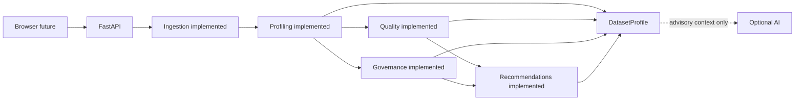

# Arquitectura

## Forma del sistema y estado actual

Monolito modular y stateless. Phase 3 implementa Ingestion, Profiling y Quality Engine; Next.js y la API de análisis siguen siendo futuros. FastAPI expone únicamente `GET /health`. No hay DB, persistencia ni microservicios.

## Módulos y boundaries

- **Ingestion** valida bytes CSV/XLSX y produce `IngestedDataset`; no crea findings semánticos.
- **Profiling** recibe `IngestedDataset`, no reparsea ni muta el DataFrame. Recoge métricas estructurales y soporte efímero de posiciones/signals deterministas, sin valores de celdas ni scores.
- **Quality** recibe solo `DatasetProfile`, no modifica el perfil ni reejecuta parsing/profiling. Posee applicability, fórmulas, penalties, scores y findings de parser conforme a `QUALITY_MODEL.md`.
- **Governance** crea classifications canónicas solo con señales deterministas.
- **Recommendations** produce `SUGGESTED` vinculadas a findings existentes mediante el paquete determinista de Phase 5.1; la exposición API sigue siendo futura.
- **Presentation/API** serializa contratos sin recalcular resultados.
- **Recommendations** consumirá `QualityScore` y `GovernanceAssessment` y producirá un `RecommendationSet` determinista; contrato definido en `RECOMMENDATIONS.md`.
### Integración Governance Engine

`DatasetProfile → Governance Engine → GovernanceAssessment`.

El Governance Engine consume `DatasetProfile`, no reabre archivos fuente, no accede a valores de celdas y no muta el perfil. Es determinista, separado del Quality Engine y no usa IA; no produce recomendaciones ni conclusiones de compliance o legales.

El lifecycle es `bytes no confiables → validación/límites → IngestedDataset → DatasetProfile → QualityScore → futura respuesta → cleanup`. Todo procesamiento actual es en memoria y sin persistencia.

## Frontera IA

**LLM output is advisory only.** Puede proponer significado, descripción, explicación y wording como `SUGGESTED`; no crea/muta Evidence canónica, findings `DETECTED`, metrics, scores ni governance classifications canónicas. No contribuye a confidence canónica ni hay aceptación humana en V0.1.

## Seguridad y dependencias

Polars realiza agregaciones y representación tabular; FastAPI/Pydantic delimitan la futura API; openpyxl lee XLSX. Los contenidos permanecen como datos no confiables: no logging de celdas, HTML crudo, paths ni instrucciones. Ver [ingestión](INGESTION.md), [profiling](PROFILING.md) y [privacidad](PRIVACY.md).
