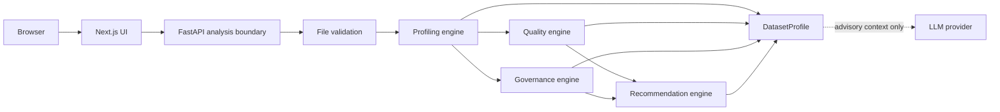

# Arquitectura

## Forma del sistema

Monolito modular y stateless. Next.js presenta; FastAPI coordina un análisis efímero; el motor Python procesa en memoria o temporal controlado. Sin DB ni microservicios en V0.1.

## Módulos y límites

- **Ingestion**: CSV/XLSX, límites y validación; no ejecuta macros ni fórmulas.
- **Profiling**: única fuente de counts, quality metrics y Evidence canónica.
- **Quality**: aplica `QUALITY_MODEL.md` sobre perfiles.
- **Governance**: crea classifications canónicas solo a partir de señales deterministas.
- **Recommendations**: solo crea sugerencias vinculadas a findings existentes.
- **Presentation/API**: serializa; no recalcula resultados.

Archivo → temporal → validación → representación tabular → perfiles → calidad/gobernanza → findings/recomendaciones → respuesta → limpieza, incluso ante error. Un análisis no tiene usuario, sesión durable, historial ni archivo guardado.

## Frontera de IA

**LLM output is advisory only.** `LLMProvider` recibe `AnalysisContext` minimizado: nombres, tipos, métricas agregadas, findings y muestras ya autorizadas. Puede proponer significado semántico, descripciones, explicaciones y wording de recomendaciones. Tales salidas son `SUGGESTED`.

El LLM **MUST NOT** crear o mutar Evidence canónica, findings `DETECTED`, quality metrics, quality scores ni governance classifications canónicas. Una sugerencia semántica LLM no puede entrar en `ColumnProfile.classifications` ni contribuir a confidence canónica V0.1. No hay aceptación humana en V0.1. Proveedores futuros: `none`, `local`, Groq, OpenAI y Anthropic; `none` es el modo base.

## Dependencias y seguridad

Polars para agregación; FastAPI/Pydantic para frontera HTTP y contratos; openpyxl solo para inspección segura XLSX si hace falta. Next.js/TypeScript/Tailwind en cliente. Ninguna se instala en esta fase.

Límites de bytes/filas/columnas/tiempo, whitelist y verificación de contenido; rechazo `.xlsm`; XLSX como ZIP no confiable; texto saneado antes de UI, logs o prompts. Ver [privacidad](PRIVACY.md).
