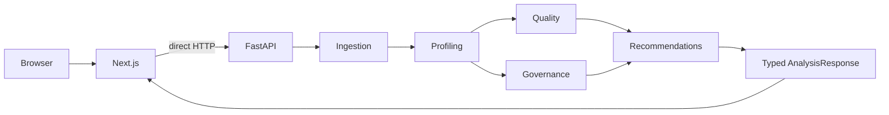

# Arquitectura

## Sistema implementado

Data Governance Copilot V0.1 es un monolito modular y stateless con frontend Next.js y backend FastAPI. La ruta publica implementada es:

El navegador envia `multipart/form-data` directamente a `POST /api/v1/analyze` usando `NEXT_PUBLIC_API_BASE_URL`. Next.js no contiene route handlers de API, middleware de proxy ni una segunda capa de reglas. FastAPI tambien expone `GET /health`.

Cada analisis conserva una respuesta HTTP sincrona y atomica: o devuelve un `AnalysisResponse` completo o un error seguro. El trabajo de dominio se deriva a un thread para mantener receptivo el event loop, pero no se convierte en un job de background ni se persiste. No hay base de datos, persistencia, autenticacion, cola, worker de background, microservicios ni estado de sesion del servidor. El resultado vive de forma efimera en el estado del navegador y se pierde al recargar o reiniciar el flujo.

## Flujo y responsabilidades

`bytes no confiables -> IngestedDataset -> DatasetProfile -> QualityScore + GovernanceAssessment -> RecommendationSet -> AnalysisResponse`

- **Ingestion** valida filename, formato, contenido y limites antes de producir un `IngestedDataset` con Polars. No crea conclusiones semanticas.
- **Profiling** consume el DataFrame una vez y crea metricas, tipos, candidate identifiers, findings estructurales y evidence. No asigna clasificaciones de gobernanza ni scores.
- **Quality Engine** consume `DatasetProfile` y calcula aplicabilidad, dimensiones, pesos, overall score y findings propios. No reabre el archivo ni modifica el perfil.
- **Governance Engine** consume `DatasetProfile` y produce un `GovernanceAssessment` separado con clasificaciones, findings, evidence y summary canonicos.
- **Recommendation Engine** consume `QualityScore` y `GovernanceAssessment`; genera acciones `SUGGESTED` enlazadas a findings existentes.
- **Analysis service** orquesta las etapas y serializa solo modelos seguros; excluye bytes, DataFrame, raw cells, muestras y posiciones internas de duplicados.
- **Frontend** realiza solo preflight de archivo, llama a la API y presenta la respuesta. Formatea, agrupa y une por ids canonicos, pero no recalcula reglas.

### Frontera del Governance Engine

`DatasetProfile -> Governance Engine -> GovernanceAssessment`.

El Governance Engine no reabre archivos fuente, no accede a raw cell values y no muta `DatasetProfile`. Es determinista, esta separado del Quality Engine y no produce recomendaciones, score de compliance ni conclusiones legales.

## Evidence-first y frontera IA

`DETECTED` representa un hecho calculado; `INFERRED`, una clasificacion sustentada por señales y su incertidumbre; `SUGGESTED`, una accion propuesta. Findings y evidence pertenecen al motor que los crea, y cada Recommendation referencia el finding que la origina.

V0.1 no contiene proveedor LLM, endpoints de IA ni generacion de contenido. Una capa IA futura es opcional y advisory-only: no puede crear o mutar evidence canonica, findings `DETECTED`, metricas, scores ni clasificaciones canonicas.

## Seguridad y despliegue

El procesamiento de dominio es en memoria y sin persistencia por defecto. La API limita el body HTTP y la ingestion limita archivo, filas, columnas, hojas, celdas y expansion XLSX. Los detalles estan en [INGESTION.md](INGESTION.md), [API.md](API.md) y [PRIVACY.md](PRIVACY.md).

La configuracion local canonica usa Next.js en `http://localhost:3000` y FastAPI en `http://127.0.0.1:8000`, con CORS explicito. La capa HTTP incluye rate limit y admision/timeout configurables y locales a cada proceso, con una ejecucion concurrente por defecto. Son defensas para una demo controlada, no controles distribuidos: un despliegue publico debe añadir aislamiento, hard timeouts, limites de proxy/plataforma, controles de abuso por cliente, monitorizacion, TLS y su propia allowlist CORS. Consulta [DEPLOYMENT.md](DEPLOYMENT.md).

## Dependencias principales

FastAPI y Pydantic delimitan la API, Polars sustenta el perfil tabular y openpyxl lee XLSX. Next.js y React presentan la respuesta como datos escapados; no existe renderizado HTML arbitrario. Consulta [FRONTEND.md](FRONTEND.md) y [RELEASE.md](RELEASE.md) para la integracion y ejecucion verificadas.
